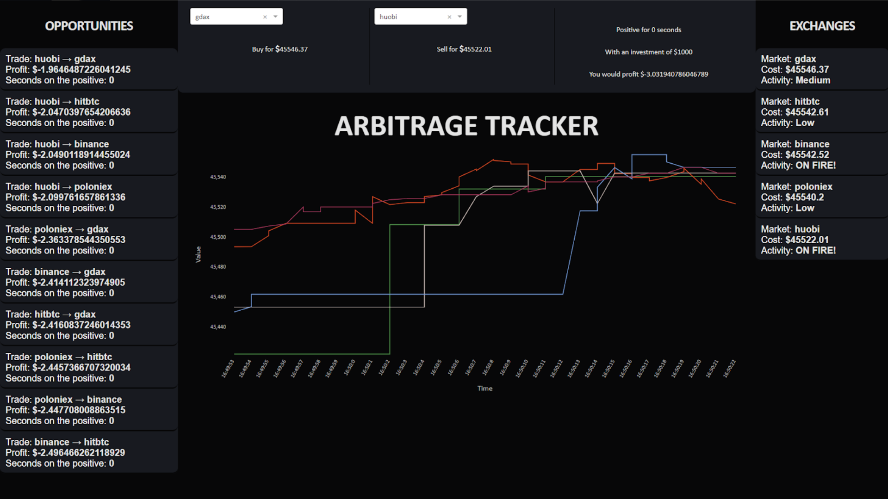
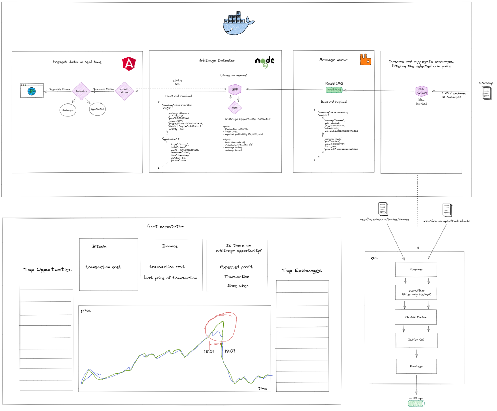

<p align="center">
  
</p>
<p align="center">A feed of opportunities for short, profitable trades</p>
<hr/>
</a>

<p align=center>
<p align="center">
<a href="https://open.vscode.dev/ricardoebbers/arbitrage-tracker" title="Open in VSCode">

</a>
<a href="https://github.dev/ricardoebbers/arbitrage-tracker" title="Open in VSCode Web">

</a>
</p>
<p align="center">
<a href="/kirin"> </a>
<a href="/back"> </a>
<a href="/front"> </a>
<a href="/front"> </a>
<a href="/kirin"> </a>
</p>


## Introduction  

This is a Hackathon project for the 2020.2 Distributed Systems (IF1015) class at UFPE.  
It was idealized and built as a team in a single weekend, serving as the grading of each member.  
The project was judged by a team of instructors and tied for 1st place.  

### Context
> Arbitrage describes the act of buying a security in one market and simultaneously selling it in another market at a higher price, thereby enabling investors to profit from the temporary difference in cost per share.

Due to the decentralized nature of cryptocurrency trading, a difference in prices even for a few seconds can result in an opportunity to exploit such a window for profit.  
There are however taxes for each of the markets, making this process harder to happen and detect.

This project then uses free real-time crypto market data streams to detect such opportunities, calculating the taxes and possible profits of every market pairing for Bitcoin.  
The taxes are currently mocked, but can be easily filled with real data as explained in below topics.


## Interface



## Architecture
### 1. Kirin
Made in Elixir, Kirin is what feeds the entire system with a constant stream of filtered data.  

It gets information from Coincap's websocket, filtering for Bitcoin to USD exchange data.  
After some data manipulation and buffering, it sends the clean data to a RabbitMQ queue for the back-end.  

### 2. Back-End
Using Node.js and RXJS to detect arbitrage opportunities and generate relevant information.  

Using the data from Kirin, it calculates the expected profit considering the transaction costs and taxes of all exchanges.  
Considering some past data on memory, the exchanges are judged according to recent activity and past prices.  
90 seconds of the data are then made available on a websocket as a cold stream.  

### 3. Front-End  
The information is shown in real-time on a page built with TypeScript and Angular.

With the stream of data from the back-end websocket, the information is added to graph and several widgets.
The user can get information on all trades or read more details about one specific exchange pair.
Arbitrage opportunities are highlighted on the top of the list, also showing the opportunity window time.

### Virtual Whiteboard

<a href="assets/architecture-design.excalidraw">Import to Excalidraw</a>

## Usage

The project uses Docker, with the following containers:
- front
- back
- kirin
- rabbitmq

The commands necessary to prepare and initialize them are:
```
cd back && npm ci
cd front && npm ci
docker-compose up -d --build
```

The Front-end can then be accessed at `http://localhost:4200/`

### Customization
You can modify the <a href=".env">.env</a> file in the root of this project to choose which Exchanges will be used from Coincap.  
By default, they are: `binance, huobi, hitbtc, zb, gdax, bitfinex, bitstamp, poloniex, gemini, luno, bitso, therocktrading, coinmate`

At <a href ="back/src/opportunities/exchange_data.js">exchange_data.js</a>, the taxes for each exchange can be modified, but by default every 0.125% tax on buying and selling.  
The taxes can be a fixed cost and/or a percentage.
```js
  "huobi": {
    "buyCost": 0,
    "sellCost": 0,
    "buyTax": 0.00125,
    "sellTax": 0.00125
  },
```

## Team

<a href="https://github.com/jrcamelo">João Camelo - jrsc2</a>  
<a href="https://github.com/lira1705">João Lira - jpls</a>  
<a href="https://github.com/ricardoebbers">Ricardo Ebbers - recl</a>  
